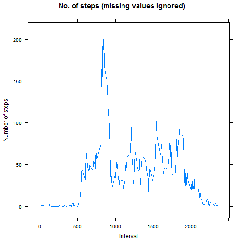
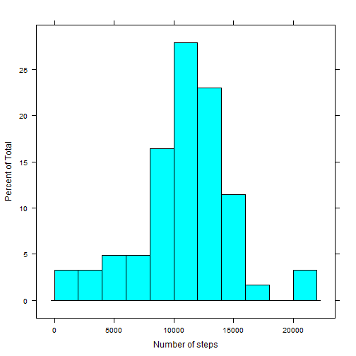

## Loading dependencies

```r
library(lattice)
```


## Loading and data preprocessing the data

```r
activity<-read.csv("activity.csv",stringsAsFactors =FALSE)
activity$date<-as.Date(strptime(activity$date,"%Y-%m-%d"))
activity$weekdayNum<-as.POSIXlt(activity$date)$wday
activity$weekday<-weekdays(activity$date,abbreviate = T)
activity$weekendFlag<-as.factor(ifelse(activity$weekdayNum %in% c(0,6),"weekend","weekday"))
```
#### Summary loaded data set

```r
str(activity)
```

```
## 'data.frame':	17568 obs. of  6 variables:
##  $ steps      : int  NA NA NA NA NA NA NA NA NA NA ...
##  $ date       : Date, format: "2012-10-01" "2012-10-01" ...
##  $ interval   : int  0 5 10 15 20 25 30 35 40 45 ...
##  $ weekdayNum : int  1 1 1 1 1 1 1 1 1 1 ...
##  $ weekday    : chr  "Mon" "Mon" "Mon" "Mon" ...
##  $ weekendFlag: Factor w/ 2 levels "weekday","weekend": 1 1 1 1 1 1 1 1 1 1 ...
```


#### Splitting incomplete & complete observations

```r
activityComplete<-activity[complete.cases(activity),]
activityInComplete<-activity[!complete.cases(activity),]
nrow(activityComplete)
```

```
## [1] 15264
```

```r
nrow(activityInComplete)
```

```
## [1] 2304
```

## What is mean total number of steps taken per day?

```r
activityDailySum<-aggregate(steps~date,activityComplete,sum)
histogram(activityDailySum$steps,xlab="Number of steps",ylab="Frequency",breaks = 10,
          ,main="No. of steps (missing values ignored)")
```

 

```r
mean(activityDailySum$steps)
```

```
## [1] 10766.19
```

```r
median(activityDailySum$steps)
```

```
## [1] 10765
```

## What is the average daily activity pattern?

```r
activityIntAvg<-aggregate(steps~interval,activityComplete,mean)
xyplot(steps ~ interval,data=activityIntAvg,type="l",xlab="Interval",ylab="Number of steps"
       ,main="No. of steps (missing values ignored)")
```

 
### Interval with the maximum number of average steps

```r
activityIntAvg$interval[which(activityIntAvg$steps==max(activityIntAvg$steps))]
```

```
## [1] 835
```


## Imputing missing values

### Total missing values

```r
nrow(activityInComplete)
```

```
## [1] 2304
```

### Imputing Strategy: Compute means for each interval and weekday for the non missing data set. Impute the missing data with the means computed.

```r
meansImpute<-aggregate(steps~interval+weekdayNum,activityComplete,mean)
activityInComplete<-activityInComplete[,-c(1)]
activityImpute<-merge(activityInComplete,meansImpute,all.x=TRUE)
nrow(activityImpute)
```

```
## [1] 2304
```

```r
activityImpute<-rbind(activityComplete,activityImpute[,c(6,3,1,2,4,5)])
nrow(activityImpute)
```

```
## [1] 17568
```
#### Row counts shows there could not be any data loss.

### Histogram of total number of steps and computed means & medians after missing values are imputed

```r
activityDailySum<-aggregate(steps~date,activityImpute,sum)
histogram(activityDailySum$steps,xlab="Number of steps",breaks = 10)
```

 

```r
mean(activityDailySum$steps)
```

```
## [1] 10821.21
```

```r
median(activityDailySum$steps)
```

```
## [1] 11015
```

#### We notice the mean of imputed dataset are higher than non imputed by about 50 steps. This is because the daily average for the missing days (weekdays) is higher than the daily averages of non missing days.

## Are there differences in activity patterns between weekdays and weekends?

```r
activityIntWeekAvg<-aggregate(steps~interval+weekendFlag,activityComplete,mean)
xyplot(steps ~ interval | weekendFlag,data=activityIntWeekAvg,
       layout=c(1,2),type="l",xlab="Interval",ylab="Number of steps")
```

 

#### On weekends activity levels seems consitent and higher than weekdays, possibly due to more outdoor activities.
